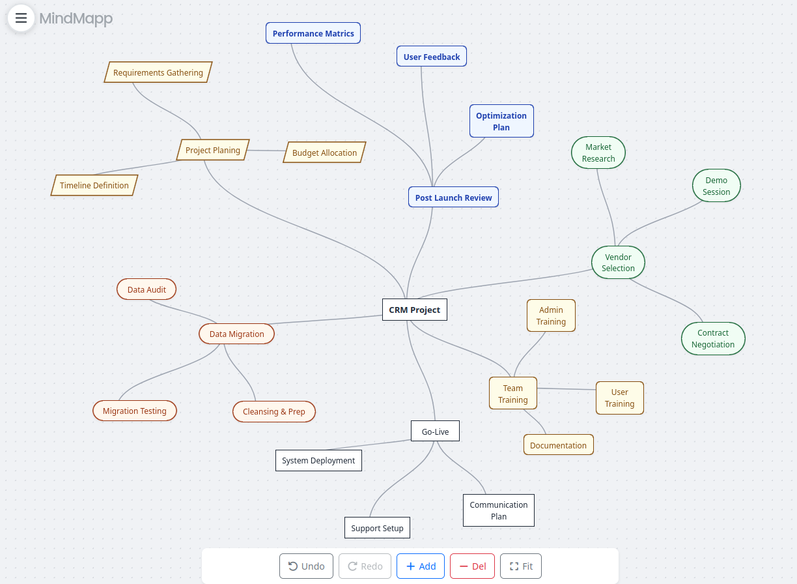

# MindMapp V2

Try out MindMapp V2 here: [https://mindmapp-v2.vercel.app](https://mindmapp-v2.vercel.app)

Originated from - [https://github.com/cepa/mindmapp](https://github.com/cepa/mindmapp)

An intuitive mind mapping application for organizing thoughts, brainstorming ideas, and creating visual representations of your concepts.

Try out MindMapp here: 



## Features

### 100% Keyboard-Driven Workflow
MindMapp is designed for **complete keyboard control** - you can create, navigate, edit, style, and organize your entire mind map without ever touching the mouse!

- **Full Keyboard Navigation**: Arrow keys for spatial navigation, Tab for smart child creation
- **Multi-Select**: Mark multiple nodes with 'M' key, then delete, style, or move them all together
- **Quick Creation**: Shift+Arrow instantly creates children in any direction with inherited styling
- **Smart Navigation**: Hover effects automatically hide during keyboard use for distraction-free flow
- **Precision Control**: Ctrl+Arrow moves nodes with accelerating speed for pixel-perfect positioning

### Enhanced Input Support
- **Spotlight Search**: Press `/` for a floating, transparent search bar to instantly find and teleport to ideas (VIM-style)
- **Smooth Touchpad**: True diagonal two-finger panning with balanced horizontal/vertical speeds
- **Pinch Zoom**: Ctrl+Scroll for zoom (intercepts browser zoom for app-level control)
- **Touch Support**: Full mobile compatibility with pinch-to-zoom and touch drag
- **Drag & Drop**: Click and drag nodes or groups to reposition

### Rich Customization
- **Style Nodes**: Bold, Italic, 6 color themes, 4 shapes (Rectangle, Rounded, Pill, Diamond)
- **Style Inheritance**: Children automatically inherit parent's colors and shapes
- **Visual Indicators**: Clear color-coded borders (Amber=focus, Green=multi-select, Blue=focused in selection, Purple=editing)

### Data Management
- **Import/Export**: Save and load mind maps as .mind files
- **Undo/Redo**: Full history support with up to 50 actions
- **Auto-Save**: LocalStorage persistence

### Navigation
- **Zoom & Pan**: Navigate large mind maps with ease (Infinite Canvas)
- **Responsive Design**: Works on desktop, tablet, and mobile devices

## Getting Started

### Prerequisites
- Node.js 20+
- npm or yarn
- Angular CLI

### Installation
```bash
cd app
npm install
```

### Development Server
```bash
npm start
```
Open `http://localhost:4200` in your browser.

### Build for Production
```bash
npm run build
```

## Docker Deployment

### Using Docker Compose
```bash
docker-compose up -d
```
Access the application at `http://localhost:8080`

### Manual Docker Build
```bash
docker build -t mindmapp .
docker run -p 8080:8080 mindmapp
```

## Usage

### Basic Operations
- **Create nodes**: Click "Add" handles on selected node, press `Tab`, or use `Shift + Arrow` keys.
- **Edit nodes**: Double-click any node, press `Enter`, or press `F2` to edit text.
- **Move nodes**: 
  - Drag with mouse/touch.
  - Use `Ctrl + Arrow` keys for precision movement (accelerates over time).
- **Delete nodes**: Select a node and press `Delete`, `Backspace`, or `-`.

### Navigation
- **Zoom**: Mouse wheel or pinch gesture.
- **Pan**: Click and drag on empty space or use touch drag.
- **Focus**: Use `Arrow` keys to navigate between nodes.

## Keyboard Shortcuts

**Note: Every feature is fully accessible via keyboard!**

| Action | Windows/Linux | Mac |
|--------|---------------|-----|
| **Navigation** | | |
| Navigate Focus | `Arrow Keys` | `Arrow Keys` |
| Precision Move Node(s) | `Ctrl + Arrow` | `Cmd + Arrow` |
| Center Selection | `Space` | `Space` |
| Reset View | `0` | `0` |
| Search & Jump | `/` | `/` |
| **Multi-Select (Keyboard Only!)** | | |
| Mark/Unmark Node | `M` | `M` |
| Select All | `Ctrl+A` | `Cmd+A` |
| Clear Selection | `Escape` | `Escape` |
| Multi-Select with Mouse | `Ctrl+Click` | `Cmd+Click` |
| _All operations work on selected group_ | _Delete, Style, Move_ | _Delete, Style, Move_ |
| **Creation** | | |
| Auto-Add Child | `Tab` | `Tab` |
| Add Child in Direction | `Shift + Arrow` | `Shift + Arrow` |
| **Editing** | | |
| Edit Text | `Double-click` / `F2` / `Enter` | `Double-click` / `F2` / `Enter` |
| Finish Editing | `Enter` / `Esc` | `Enter` / `Esc` |
| Delete Node(s) | `Del` / `Backspace` / `-` | `Del` / `Backspace` / `-` |
| **Structure (VIM-like)** | | |
| Promote (Move Up Hierarchy) | `Alt + Left` | `Alt + Left` |
| Demote (Move Down Hierarchy) | `Alt + Right` | `Alt + Right` |
| Toggle Fold/Collapse | `F` or `C` | `F` or `C` |
| **View Control** | | |
| Fold to Level 1-5 | `Ctrl + 1-5` | `Cmd + 1-5` |
| Expand All | `Ctrl + 0` | `Cmd + 0` |
| Lock Navigation to Level 1-5 | `Shift + 1-5` | `Shift + 1-5` |
| Clear Navigation Lock | `Shift + 0` | `Shift + 0` |
| **Styling** | | |
| Toggle Bold | `Ctrl + B` | `Cmd + B` |
| Toggle Italic | `Ctrl + I` | `Cmd + I` |
| Cycle Shape | `Shift + S` | `Shift + S` |
| Cycle Color | `Shift + C` | `Shift + C` |
| **System** | | |
| Undo | `Ctrl+Z` | `Cmd+Z` |
| Redo | `Ctrl+Y` | `Cmd+Shift+Z` |
| Save (.mind) | `Ctrl+S` | `Cmd+S` |
| Load (.mind) | `Ctrl+O` | `Cmd+O` |
| Export Mermaid | `Ctrl+Alt+E` | `Cmd+Alt+E` |
| Import Mermaid | `Ctrl+Alt+I` | `Cmd+Alt+I` |
| Help | `Ctrl+K` | `Cmd+K` |

### Multi-Select Workflow Example
```
1. Arrow → Arrow → M (mark first node - green ✓)
2. Arrow → Arrow → M (mark second node - green ✓)
3. Arrow → M (mark third node - green ✓)
4. Shift+C (change color of all 3 nodes together)
5. Ctrl+Arrow (move all 3 nodes together)
6. Delete (delete all 3 nodes at once)
```

## Data Format

MindMapp uses a versioned JSON format (.mind files) for storing mind maps:

```json
{
  "version": "1",
  "metadata": {
    "title": "My Mind Map",
    "created": "2023-10-15T10:30:00Z",
    "modified": "2023-10-15T14:45:00Z"
  },
  "nodes": [
    {
      "id": "node-1",
      "parentId": null,
      "text": "Main Topic",
      "type": "root",
      "position": { "x": 0, "y": 0 }
    }
  ]
}
```

## Documentation

- [GEMINI.md](GEMINI.md) - System context and architecture

## License

MIT
